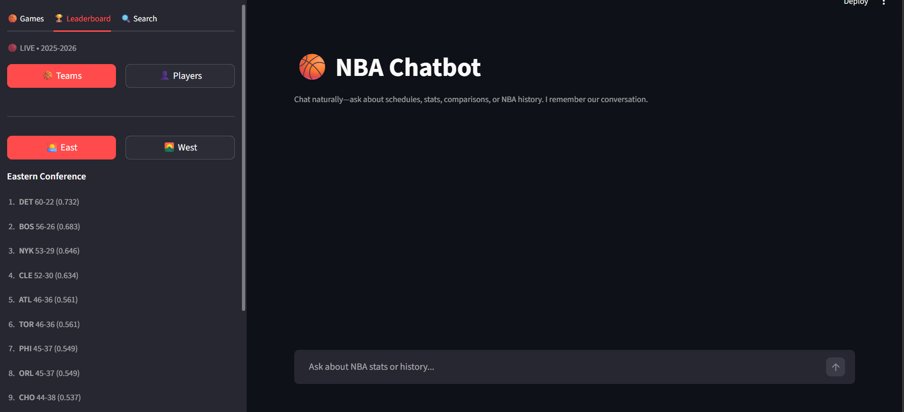
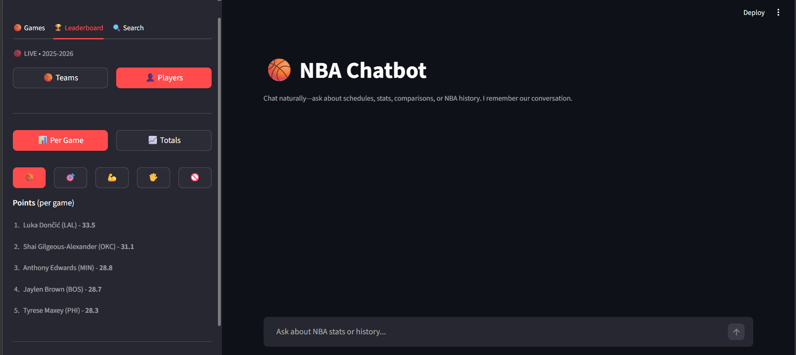
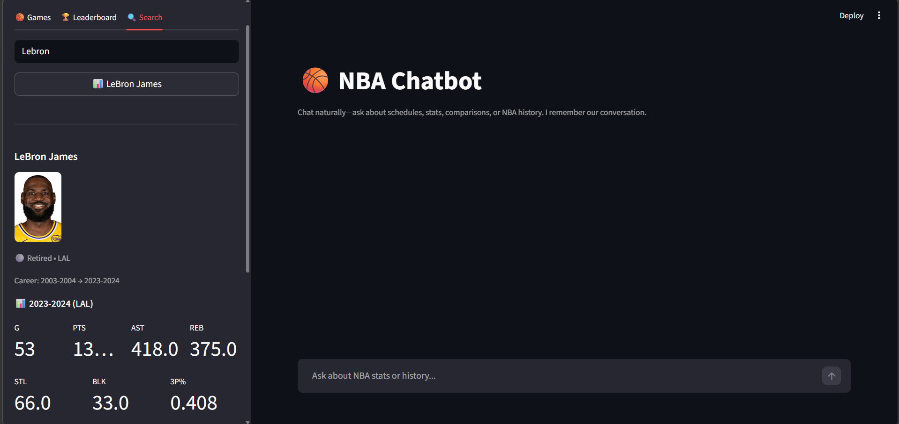

# NBA Chatbot

A-Z NBA encyclopedia and analytics data tool - chat about anything NBA, or pull clean datasets for your analytics projects.

## Why I built this

As an analytics student, I kept running into the same problem: finding proper NBA datasets for projects was a pain. This chatbot solves that. Ask for any stats, get an instant preview, and download a ready-to-use CSV or Excel file. It also covers everything else - news, history, live scores, standings, player bios, draft history.

**Two types of users:**
- **Basketball fans** - chat about news, controversies, live scores, standings, history
- **Analytics students** - get clean downloadable datasets for any NBA query

## Quick Start

1. **Install dependencies**
   ```bash
   pip install -r requirements.txt
   ```

2. **Create `.env`** in project root with your Gemini API key:
   ```
   GOOGLE_API_KEY=your-gemini-key-here
   ```
   Get a free key at https://aistudio.google.com/apikey

3. **Run the app**
   ```bash
   streamlit run app.py
   ```

4. Open http://localhost:8501 and start asking.

## What You Can Ask

### Player Stats
- `"curry last 3 seasons"` - multi-season stats
- `"lebron this season"` - current season
- `"kevin durant 2022-23 stats"` - specific season
- `"give me stats for kevin durant and stephen curry last 3 seasons"` - multiple players at once
- `"giannis playoff stats 2024"` - playoff-specific

### Team Data
- `"warriors 2023-24 full team stats"` - entire roster stats as CSV
- `"celtics advanced stats this season"` - efficiency metrics

### Game Logs
- `"curry game by game stats 2024-25"` - every game played, downloadable
- `"lebron last 20 games"` - recent game log

### Draft
- `"2003 nba draft"` - full draft class
- `"who did the lakers draft in 2010"` - team-specific picks

### Advanced Metrics
- `"giannis PER this season"` - player efficiency rating
- `"top true shooting percentage leaders"` - league-wide advanced stats
- `"highest usage rate players"` - leaderboards

### League-wide
- `"all nba player stats 2023-24"` - full league dataset (500+ players), downloadable
- `"player impact estimate top 20"` - PIE leaderboard

### Player Info
- `"tell me about wemby"` - bio, height, weight, college, draft info, nationality
- `"how tall is giannis"` - quick bio lookup
- Nicknames work: "Greek Freak", "King James", "Steph", "KD", "Dame", "Joker", etc.

### Live Sidebar (auto-refreshes)
- Today's scores / live games
- League standings (by conference)
- Scoring, rebounding, assists leaderboards
- Player and team search

### News & History (Gemini + Google Search)
- `"latest nba news"` - real-time via Google Search grounding
- `"what happened in the 2016 finals"` - history
- `"mvp race this season"` - current narratives
- `"biggest nba controversies"` - editorial content

## Data Export

Every stats query generates:
- **5-row preview table** visible in chat - see what's in the data before downloading
- **Download CSV** button - clean, ready for pandas/Excel/Tableau
- **Download Excel** button - formatted spreadsheet

Previous queries' tables and download buttons stay visible in chat history - you don't lose them when you ask a follow-up question.

## Data Sources (all free)

| Source | What it provides |
|---|---|
| `nba_api` (stats.nba.com) | Official NBA stats, 1946–present |
| NBA CDN (cdn.nba.com) | Live scoreboard, schedule |
| ESPN API | Standings |
| Gemini + Google Search | News, real-time info, history |

No paid APIs. No scraping. All official or public endpoints.

## Project Structure

```
app.py                  - Streamlit chat UI + export/download logic
src/
  orchestrator.py       - Query routing, context assembly, Gemini call
  query_parser.py       - Embedding-based intent classifier + entity extractor
  nba_api_client.py     - NBA.com data client (stats, gamelogs, draft, bios, advanced)
  live_data.py          - Live player stats, schedule from NBA.com
  sidebar_data.py       - Standings, scoreboard, leaderboards
  nba_data.py           - CSV fallback + team abbreviation map
  rag.py                - RAG: sentence-transformers + Chroma vector store
data/
  rag_docs/             - Text docs for RAG (not committed - fetch with script below)
```

## Key Design Decisions

**No LLM hallucination on numbers** - all stats come from Python tools (nba_api), not the LLM. Gemini only writes 1-2 sentence summaries around real data.

**Embedding-based intent routing** - uses `sentence-transformers/all-MiniLM-L6-v2` to classify what the user wants (player stats, team stats, draft, bio, etc.) without brittle regex rules.

**Multi-player / multi-team queries** - asking for two players or teams at once ("KD and Curry last 3 seasons", "Warriors vs Lakers stats") fetches both and combines them into a single table with a "Player" or "Team" column prepended, so you get one clean downloadable dataset instead of two separate ones.

**Persistent chat history** - DataFrames are stored in `st.session_state` alongside messages, so download buttons for earlier queries remain accessible throughout the session.

## Refresh RAG Knowledge Base

Run to update news and historical content:

```bash
python scripts/fetch_nba_content.py
```

Close the Streamlit app first (or delete `data/.chroma_db`) before running.

## Screenshots





## Run Stats Tests

```bash
python src/test_metrics.py
```
